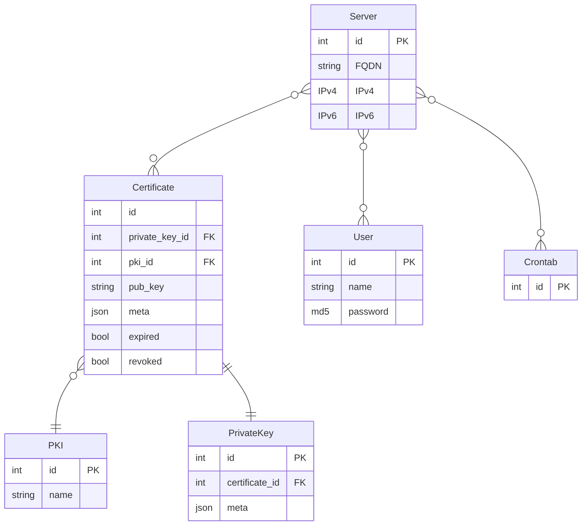

```mermaid
erDiagram
    Server {
        int id PK
        string FQDN
        IPv4 IPv4
        IPv6 IPv6
    }

    Certificate {
        int id
        int private_key_id  FK
        int pki_id FK
        string pub_key
        json meta
        bool expired
        bool revoked

    }

    PKI {
        int id PK
        string name

    }

    PrivateKey {
        int id PK
        int certificate_id FK
        json meta
    }

    User {
        int id PK
        string name
        md5 password
    }

    Crontab {
        int id PK
    }

    Server }o--o{ User: ""
    Server }o--o{ Certificate: ""
    Certificate }o--||PKI: ""
    Certificate||--||PrivateKey: ""
    Server }o--o{ Crontab: ""

```